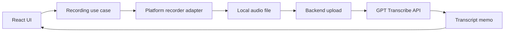

# STT Voice Memo

GPT Transcribe API를 이용해 음성으로 메모를 작성하고 관리하는 모바일 우선 크로스 플랫폼 애플리케이션입니다. Tauri 2와 React를 기반으로 먼저 iOS와 Android에서 안정적인 녹음, 음성 인식, 메모 편집 경험을 제공하고 이후 데스크톱으로 확장하는 것을 목표로 합니다.

현재 저장소는 제품 및 아키텍처를 설계하는 초기 단계입니다. 아래 기능과 디렉터리 구조는 구현 방향을 나타냅니다.

## 핵심 경험

1. 사용자가 앱에서 음성 녹음을 시작합니다.
2. 앱이 플랫폼별 녹음 기능을 통해 오디오 파일을 생성합니다.
3. 녹음 파일을 애플리케이션 백엔드로 전송합니다.
4. 백엔드가 OpenAI GPT Transcribe API로 음성을 텍스트로 변환합니다.
5. 사용자가 변환된 텍스트를 편집하고 메모로 저장합니다.

## 개발 우선순위

개발 목표의 1순위는 모바일 앱입니다. 제품과 기술 의사결정은 iOS와 Android의 권한, 오디오 세션, 앱 수명 주기 및 터치 인터페이스를 기준으로 내립니다. 데스크톱은 공통 도메인과 UI를 재사용하는 후속 지원 대상으로 다룹니다.

## 예정 기능

- iOS 및 Android 음성 녹음
- 녹음 시작, 일시 정지, 재개, 취소 및 종료
- 녹음 상태와 처리 상태를 보여주는 간결한 UI
- GPT Transcribe API 기반 음성 인식
- 변환된 텍스트의 편집 및 메모 저장
- 메모 목록, 상세 보기, 검색 및 삭제
- 실패한 업로드와 변환 요청의 재시도
- 마이크 권한 거부, 오디오 인터럽트 및 네트워크 오류 처리
- 원본 녹음 보관 여부를 사용자가 선택할 수 있는 개인정보 및 저장 공간 설정
- 모바일 핵심 흐름 검증 이후 데스크톱 녹음 지원

첫 번째 릴리스는 iOS와 Android에서 앱이 화면에 표시된 상태로 짧은 음성 메모를 녹음하는 흐름에 집중합니다. 백그라운드 녹음, 실시간 스트리밍 자막 및 데스크톱 지원은 모바일의 기본 녹음 및 변환 경험을 검증한 뒤 별도 기능으로 다룹니다.

## 기술 스택

### 애플리케이션

- Tauri 2
- Rust
- React 및 TypeScript
- shadcn/ui
- TanStack Query
- Zustand

### 역할

- **Tauri/Rust:** 플랫폼 통합, 녹음 수명 주기, 로컬 파일과 데이터 저장, 안전한 시스템 기능 노출
- **React:** 녹음, 변환, 편집 및 메모 관리 UI
- **TanStack Query:** 비동기 서버 상태, 업로드와 변환 요청, 캐시 및 재시도
- **Zustand:** 녹음 세션과 같은 클라이언트 전용 상태 및 일시적인 UI 상태
- **애플리케이션 백엔드:** 사용자 인증, OpenAI API 키 보호, 오디오 업로드, 변환 요청, 사용량 제한

OpenAI API 키는 Tauri 데스크톱 또는 모바일 번들에 포함하지 않습니다. 배포된 클라이언트는 분석될 수 있으므로 GPT Transcribe API 호출은 애플리케이션이 관리하는 백엔드를 통해 수행합니다.

## 아키텍처

### 모노레포 워크스페이스

루트 모바일 패키지와 `src-tauri` 경로는 기존 위치를 유지합니다. 향후 백엔드
모듈은 `apps/backend`, 단일 전사 계약은 `contracts`가 소유하며, 저장소 루트의
pnpm 및 Cargo 워크스페이스에서 함께 검증합니다. 모바일과 백엔드는 계약을
소비할 수 있지만 서로의 런타임 모듈을 import하지 않습니다.

```text
./                 모바일 React 패키지와 루트 명령
src-tauri/         모바일 Rust/Tauri 및 네이티브 프로젝트
apps/backend/      백엔드 모듈과 어댑터의 예약 영역
contracts/         canonical transcription OpenAPI
scripts/workspace/ 경계·drift·secret·CI scope 검증
```

구체적인 소유권, 의존 방향, 백엔드 모듈/어댑터 추가 절차는
[`docs/monorepo-workspace.md`](docs/monorepo-workspace.md)를 따릅니다.

### Rust: Hexagonal Architecture

Rust 영역은 도메인과 유스케이스가 Tauri, 운영체제, 파일 시스템, 데이터베이스 및 외부 API 구현에 직접 의존하지 않도록 구성합니다.

```text
src-tauri/src/
  domain/          순수 도메인 모델과 규칙
  ports/           녹음, 저장소, 변환 서비스 등의 인터페이스
  application/     녹음 및 메모 유스케이스
  inbound/         Tauri command 등 입력 어댑터
  infrastructure/  플랫폼, 저장소, 파일 시스템 및 HTTP 어댑터
```

예를 들어 음성 변환 유스케이스는 구체적인 HTTP 클라이언트가 아니라 `TranscriptionPort`에 의존합니다. Tauri command는 입력 어댑터로서 요청을 검증하고 application 계층을 호출하며, 플랫폼별 녹음 구현은 출력 어댑터로 연결합니다.

### React: Feature-Sliced Design

React 영역은 Feature-Sliced Design의 계층과 단방향 의존성 규칙을 따릅니다.

```text
src/
  app/       앱 초기화, 프로바이더, 라우팅 및 전역 스타일
  pages/     화면 단위 조합
  widgets/   여러 feature와 entity를 조합하는 독립 UI 블록
  features/  녹음 시작, 변환 요청, 메모 편집 등 사용자 행동
  entities/  memo, recording, transcription 등 도메인 표현
  shared/    UI primitive, Tauri/API client, 공통 유틸리티
```

상위 계층은 하위 계층을 사용할 수 있지만 하위 계층이 상위 계층에 의존하지 않도록 합니다. 서버에서 가져오거나 변경하는 상태는 TanStack Query에 두고, 로컬 상호작용 상태는 Zustand에 둡니다. 동일한 데이터를 두 상태 시스템에 중복 보관하지 않습니다.

## 녹음 및 변환 흐름



모바일 녹음은 웹뷰의 `MediaRecorder`에만 의존하지 않습니다. 공통 recorder port 뒤에 iOS용 Swift와 Android용 Kotlin 구현을 우선 배치하고, 데스크톱 구현은 후속 adapter로 추가합니다. 다음 책임은 각 플랫폼 어댑터가 담당합니다.

- 마이크 권한 요청
- 녹음 시작, 일시 정지, 재개 및 종료
- 오디오 세션과 앱 수명 주기 처리
- 전화, 오디오 경로 변경 등 인터럽트 처리
- GPT Transcribe API가 지원하는 형식의 파일 생성

## 참고 프로젝트

### Handy

[Handy](https://github.com/cjpais/Handy)의 단순한 녹음 흐름, 녹음 상태 피드백, 기록 관리 및 설정 경험을 기능·UX 참고 자료로 사용합니다. 로컬 참고 소스는 `~/project/ext/handy`에 있습니다.

Handy는 로컬 음성 인식 중심의 데스크톱 애플리케이션인 반면, 이 프로젝트는 GPT Transcribe API를 이용하는 모바일 메모 경험을 먼저 목표로 합니다. 따라서 Handy의 코드를 그대로 옮기기보다 기능 흐름과 오디오 처리 아이디어를 모바일 수명 주기와 현재 아키텍처에 맞게 적용합니다.

### Agentic Workspace

`~/project/agentic-workspace`를 Tauri와 React 프로젝트 구성의 기준으로 참고합니다. 특히 Rust의 Hexagonal Architecture와 React의 Feature-Sliced Design을 이 프로젝트의 기본 개발 원칙으로 사용합니다.

## 개발 원칙

- 도메인 규칙을 UI, Tauri command 및 외부 서비스 구현과 분리합니다.
- 플랫폼별 차이는 명시적인 port와 adapter 뒤에 둡니다.
- Tauri command를 비즈니스 로직이 모이는 장소로 사용하지 않습니다.
- 원격 서버 상태와 로컬 UI 상태의 소유권을 구분합니다.
- 개인정보와 오디오 보관 정책을 제품 기능으로 명확히 드러냅니다.
- 녹음과 업로드 작업은 재시도와 중단 이후 복구를 고려해 설계합니다.
- 공통 코드는 실제로 공유되는 정책과 동작에 한해 추출합니다.
- 모바일의 권한, 오디오 세션 및 수명 주기를 실제 iOS·Android 기기에서 우선 검증합니다.

## MVP 구현 순서

1. Tauri 2 모바일 타깃, React, TypeScript 및 터치 중심 기본 UI 구성
2. 메모 도메인, 로컬 저장소와 목록·편집 UI 구현
3. 공통 recorder port와 iOS·Android foreground recorder adapter 구현
4. 실제 iOS·Android 기기에서 권한, 오디오 인터럽트 및 앱 수명 주기 검증
5. 애플리케이션 백엔드 및 GPT Transcribe API 연동
6. 업로드 큐, 진행 상태, 오류, 오프라인 대기 및 재시도 흐름 구현
7. 모바일 사용자 흐름과 저속 네트워크 환경 검증
8. 모바일 핵심 경험이 안정된 뒤 데스크톱 recorder adapter 추가
9. 필요성이 검증되면 VAD, 백그라운드 녹음 및 실시간 변환을 별도 단계로 추가

## 설계 문서

- [`.specify/memory/constitution.md`](.specify/memory/constitution.md): 프로젝트의 필수 개발 원칙과 품질 기준
- [`docs/tauri-mobile-voice-memo.md`](docs/tauri-mobile-voice-memo.md): Tauri 모바일 녹음과 GPT Transcribe 연동 검토
- [`docs/handy-mobile-code-reuse.md`](docs/handy-mobile-code-reuse.md): Handy 오디오 처리 코드의 모바일 재사용 가능성 분석
- [`docs/ios-simulator-xcode-27-troubleshooting.md`](docs/ios-simulator-xcode-27-troubleshooting.md): Xcode 27에서 Tauri iOS Simulator 빌드·실행 문제와 해결 기록
- [`docs/monorepo-workspace.md`](docs/monorepo-workspace.md): 모바일·백엔드·계약 워크스페이스 소유권, 명령, 설정 및 CI 경계

## 개발 환경

Node.js 22.22 이상, pnpm 11.0.9, Rust stable 및 대상 플랫폼의 Tauri 필수
도구가 필요합니다.

```sh
corepack enable
pnpm install --frozen-lockfile

pnpm dev:mobile
pnpm validate:mobile
pnpm validate:backend
pnpm validate:contract
pnpm validate
```

`pnpm dev:backend`는 후속 이슈가 백엔드 런타임을 구현하기 전까지 명시적인
unavailable 결과로 종료됩니다. iOS 명령은 저장소 루트에서 `pnpm tauri ios
...` 형태로 실행합니다. Android 호스트와 루트 명령은 Issue #24에서
초기화하며, 그 전까지 Android 경로 검사는 unavailable로 보고됩니다.
