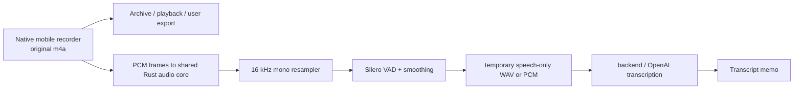

# Handy Audio Preprocessing Reuse on Tauri Mobile

## Verdict

**Do not move Handy into an iOS/Android Tauri app unchanged.** The complete Handy application is desktop-oriented and its current startup path is not mobile-buildable as written. However, its *algorithmic* VAD (voice activity detection) and 16 kHz resampling code are good candidates to extract into a small shared Rust audio-core module.

For a voice-memo product that sends recordings to OpenAI transcription, preserve the original native recording (`m4a` is a sensible mobile format) and apply Handy-style VAD only to an optional, disposable transcription input. When its VAD setting is enabled, Handy drops silent frames before it saves its WAV, so using that output as the canonical memo recording would alter pauses and the audio timeline.

## What Handy Actually Does

Handy does not first record an audio file and then trim its beginning/end. Its capture worker:

1. obtains PCM from CPAL, converts multichannel input to mono;
2. resamples to 16 kHz and groups it into 30 ms frames;
3. when VAD is enabled, runs the bundled Silero ONNX VAD;
4. when VAD is enabled, emits only frames classified as speech (with pre-roll and a post-speech tail);
5. passes the resulting `Vec<f32>` to local transcription and writes it as 16 kHz mono PCM WAV.

The setting selects the disabled, offline, or streaming VAD policy ([selection](/Users/yoophi/project/handy/src-tauri/src/actions.rs:504)). The rest of the evidence is in [the recorder's stream callback](/Users/yoophi/project/handy/src-tauri/src/audio_toolkit/audio/recorder.rs:345), [the 16 kHz/30 ms consumer pipeline](/Users/yoophi/project/handy/src-tauri/src/audio_toolkit/audio/recorder.rs:517), [the speech-or-drop branch](/Users/yoophi/project/handy/src-tauri/src/audio_toolkit/audio/recorder.rs:565), and [the WAV persistence path](/Users/yoophi/project/handy/src-tauri/src/actions.rs:681). The enabled mode is therefore a **speech-frame filter**, not a non-destructive editor.

The smoothing configuration keeps a small lead-in and trailing context: 15 prefill frames, 2 onset frames, and a 15-frame offline or 55-frame streaming hangover ([constants](/Users/yoophi/project/handy/src-tauri/src/audio_toolkit/vad/mod.rs:3), [smoothing state machine](/Users/yoophi/project/handy/src-tauri/src/audio_toolkit/vad/smoothed.rs:40)). At 30 ms per frame this is intentionally lossy silence removal, not a timestamp-preserving edit.

## Reuse Assessment

| Classification | Code | Assessment |
| --- | --- | --- |
| Reuse unchanged after extraction | `vad/mod.rs`, `vad/smoothed.rs` | Pure Rust VAD interface and smoothing state machine; no Tauri or desktop API dependency. Copy into a separately tested `audio-core` crate rather than importing Handy's application crate. |
| Reuse unchanged after extraction | `audio/resampler.rs` | `rubato`-based PCM resampling/frame assembly is platform-neutral. It resets state between recordings, which prevents prior audio leaking into the next session ([implementation](/Users/yoophi/project/handy/src-tauri/src/audio_toolkit/audio/resampler.rs:15)). |
| Reuse with mobile packaging and device validation | `vad/silero.rs` plus `silero_vad_v4.onnx` | The source needs only 16 kHz 480-sample frames ([Silero wrapper](/Users/yoophi/project/handy/src-tauri/src/audio_toolkit/vad/silero.rs:9)), but `vad-rs` loads ONNX Runtime and the model from a filesystem path. Bundle/link an iOS XCFramework and Android ABI libraries, expose the model path, and test on devices. Keep the threshold (Handy uses 0.3) configurable ([construction](/Users/yoophi/project/handy/src-tauri/src/managers/audio.rs:20)). |
| Reuse with an adapter | `audio/utils.rs` | WAV encoding is portable, but it always writes **16 kHz, mono, 16-bit PCM** ([writer](/Users/yoophi/project/handy/src-tauri/src/audio_toolkit/audio/utils.rs:30)). Use it only for a temporary transcription artifact; it cannot read or preserve mobile `m4a` recordings. |
| Do not reuse unchanged | `audio/recorder.rs`, `audio/device.rs`, `managers/audio.rs` | These own desktop-style CPAL device selection, a long-lived worker and synchronous stop/drain flow. CPAL itself supports iOS (CoreAudio) and Android (AAudio), but Handy has no mobile permission, lifecycle, audio-session, interruption, route-change, or background-service integration. On iOS CPAL exposes only a `Default Device` today ([CPAL iOS enumeration](/Users/yoophi/.cargo/registry/src/index.crates.io-1949cf8c6b5b557f/cpal-0.16.0/src/host/coreaudio/ios/enumerate.rs:11)), so Handy's microphone-picker UX is not meaningful there. |
| Not reusable for this product | full `lib.rs`, tray/overlay/shortcut/input stack, local model stack | Desktop tray, global shortcuts, simulated paste and autostart do not map to mobile. Handy's local `transcribe-rs`/`transcribe-cpp` model pipeline is also separate from OpenAI API transcription. |

### Important nuance about CPAL

CPAL is not the blocker: version 0.16 declares iOS/CoreAudio and Android/AAudio support ([upstream supported-host list](https://github.com/RustAudio/cpal/blob/cpal-v0.16.0/README.md#supported-platforms)), and its manifest includes platform-specific iOS and Android dependencies ([locked local manifest](/Users/yoophi/.cargo/registry/src/index.crates.io-1949cf8c6b5b557f/cpal-0.16.0/Cargo.toml:114)). Thus the PCM capture mechanics can be ported. The blocker is treating a desktop recorder implementation as a complete mobile recorder without implementing the native operating-system contract.

## Why the Full Handy App Cannot Be Used As-Is

1. Its manifest correctly excludes autostart, global-shortcut, single-instance, and updater dependencies for Android/iOS ([`Cargo.toml`](/Users/yoophi/project/handy/src-tauri/Cargo.toml:91)), but `lib.rs` unconditionally imports autostart ([line 45](/Users/yoophi/project/handy/src-tauri/src/lib.rs:45)) and unconditionally registers updater, global-shortcut, and autostart ([lines 809–822](/Users/yoophi/project/handy/src-tauri/src/lib.rs:809)). A mobile target will therefore require `cfg` separation before it can build.
2. The ordinary startup path unconditionally creates a tray icon, configures autostart, and creates a recording overlay ([initialization](/Users/yoophi/project/handy/src-tauri/src/lib.rs:149)). Those are desktop interaction concepts, not a mobile recording lifecycle.
3. The recorder detects permissions by matching desktop/CoreAudio error text ([helper](/Users/yoophi/project/handy/src-tauri/src/audio_toolkit/audio/recorder.rs:459)); it does not request iOS or Android microphone permission. Handy's `Info.plist` has a microphone usage string ([file](/Users/yoophi/project/handy/src-tauri/Info.plist:5)), but there is no generated Android project/manifest or mobile permission implementation in this checkout.
4. The bundled VAD goes through the git-pinned `vad-rs` crate and ONNX Runtime ([dependencies](/Users/yoophi/project/handy/src-tauri/Cargo.toml:51)). ONNX Runtime supports mobile, but iOS and Android require platform-specific packaging/build choices ([ONNX Runtime Mobile](https://onnxruntime.ai/docs/get-started/with-mobile.html), [iOS build](https://onnxruntime.ai/docs/build/ios.html), [Android build](https://onnxruntime.ai/docs/build/android.html)). This is an integration task, not a source-only copy.

## Mobile Design Recommendation

Create a `recorder` Tauri mobile plugin with the same app-facing API on every platform. Tauri's supported path is a Kotlin Android plugin and a Swift iOS plugin, with optional JNI/C FFI back into shared Rust code ([Tauri mobile plugin documentation](https://v2.tauri.app/develop/plugins/develop-mobile/)).

- **iOS:** request microphone access; configure `AVAudioSession` for recording and handle route/interruption events in Swift. The default iOS audio session does not allow recording; background recording requires the `audio` background mode and user consent ([Apple AVAudioSession](https://developer.apple.com/documentation/avfaudio/avaudiosession), [record category](https://developer.apple.com/documentation/AVFAudio/AVAudioSession/Category-swift.struct/record)).
- **Android:** request `RECORD_AUDIO`; for screen-locked/background capture, start a microphone foreground service while an activity is visible and show its required ongoing notification. Recent Android versions restrict starting microphone foreground services from the background ([Android foreground-service restrictions](https://developer.android.com/develop/background-work/services/fgs/restrictions-bg-start)).
- **Shared Rust:** accept native PCM frames for live VAD/resampling, or run VAD after recording via a properly decoded PCM stream. Do not feed an `m4a` directly to Handy's `hound` helper.
- **Memo semantics:** keep the untouched native file. Only create the speech-only stream when the user opts into silence removal for transcription/cost/latency. Record VAD segment timestamps if the UI needs to show where silences were removed.

For an MVP that records only in the foreground and uploads the original file to the backend/OpenAI, VAD can be postponed. Add extracted Handy VAD only when silent audio meaningfully affects upload cost, transcription latency, or UX.

## Recommended Implementation Sequence

1. Build native foreground recorders that return an original `m4a` plus duration and route/interruption state.
2. Extract `SmoothedVad` and `FrameResampler` into a new internal Rust crate with the existing reset tests retained.
3. Add `SileroVad` only after proving ONNX Runtime packaging on a physical iPhone and Android device; test built-in, Bluetooth, wired, and interrupted recordings.
4. Send the original recording to the transcription backend by default. If VAD is enabled, send a separately generated speech-only temporary artifact and retain segment metadata.
5. Implement background recording separately in Swift/Kotlin; do not keep a CPAL/Rust worker alive as the lifecycle authority.

## Licensing Note

Handy's repository code is MIT-licensed ([license](/Users/yoophi/project/handy/LICENSE:1)), so retain its copyright and license notice when copying substantial code. The bundled `silero_vad_v4.onnx` is fetched from Handy's blob storage in the contribution instructions ([source](/Users/yoophi/project/handy/CONTRIBUTING.md:57)); its upstream model redistribution terms are not documented in this checkout. Confirm those terms separately before shipping that binary.

## Scope and Evidence

This review inspected Handy source and manifests without modifying the Handy repository. It is a code-structure and dependency assessment, not an iOS/Android device test; the local toolchain did not have mobile Rust targets installed.
