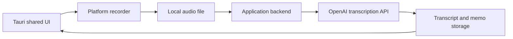

# Tauri Mobile Voice Memo Feasibility

## Decision

Tauri 2 is a suitable choice for a voice-to-text memo application that targets iOS, Android, and desktop platforms.

The application should share its UI, memo domain logic, storage model, and synchronization flow across platforms. Audio capture and background recording, however, must be treated as platform integrations: implement them through native Tauri mobile plugins (Swift on iOS and Kotlin on Android) behind a common recorder interface.

## Recommended Architecture



### Responsibilities

- **Tauri application:** shared interface, memo editing, local persistence, search, and synchronization state.
- **Platform recorder:** microphone permission, start/stop/pause recording, audio-session management, and audio file creation.
- **Application backend:** authenticates the user, owns the OpenAI API key, uploads audio, requests transcription, and applies rate limits and usage controls.
- **Storage:** retain the transcription as the primary memo data; retaining the source audio should be a user-visible privacy and storage decision.

## OpenAI Transcription

Use the Audio Transcriptions API with `gpt-4o-transcribe` for higher quality or `gpt-4o-mini-transcribe` where cost and latency matter more. The API accepts common recording outputs such as `m4a`, `mp3`, `wav`, and `webm`.

Do not embed an OpenAI API key in a Tauri desktop or mobile bundle. A shipped client can be inspected, so the client should send recordings to an application-controlled backend instead.

For the first release, prefer this interaction:

1. The user records a memo.
2. The app finalizes a local audio file.
3. The file uploads to the backend.
4. The backend requests transcription and returns the text.
5. The app saves the memo locally and synchronizes it as appropriate.

This is simpler and more reliable than attempting live transcription. If live text while the user speaks becomes a core requirement, design a separate streaming or Realtime path, including audio chunking, partial-transcript reconciliation, reconnect behavior, and explicit latency targets.

## Mobile Considerations

### Foreground-only MVP

An MVP may record only while the app is visible. This has the lowest implementation and review risk and is sufficient for short voice memos.

### Background Recording

Background recording is feasible, but it requires native platform work beyond a webview recorder:

- **iOS:** request microphone permission, provide a clear microphone-usage message, configure the appropriate background audio capability, and manage the AVAudioSession lifecycle.
- **Android:** request `RECORD_AUDIO` permission and use a microphone foreground service for recording after the app is no longer visible. The service must expose a persistent user-facing notification and declare the relevant foreground-service type and permissions.

Android restricts microphone use in the background; Android 9 and later require a foreground service for background recording. Newer Android versions impose additional foreground-service declaration and permission requirements.

### Recorder Implementation

Do not make browser `MediaRecorder` behavior the only recording implementation. Codec support, interruptions, lifecycle handling, and background behavior differ across iOS and Android webviews. Define a small common interface such as:

```ts
interface Recorder {
  requestPermission(): Promise<PermissionState>
  start(): Promise<void>
  pause(): Promise<void>
  resume(): Promise<void>
  stop(): Promise<{ path: string; mimeType: string; durationMs: number }>
}
```

Use native implementations on mobile and a platform-appropriate implementation on desktop. Ensure every recorder output is converted or configured to an OpenAI-supported upload format before it reaches the backend.

## Tauri-Specific Guidance

Tauri 2 supports Android and iOS targets and lets plugins include native Kotlin and Swift implementations. Its capability and permission systems should grant only the commands and filesystem access required by the recorder and local memo storage.

Treat mobile recorder support as a first-class plugin boundary from the start. The shared JavaScript/Rust application should not depend on Android or iOS APIs directly.

## Delivery Plan

1. Build the cross-platform memo UI and local transcript storage.
2. Implement foreground recording for desktop, iOS, and Android through the common recorder interface.
3. Add the backend transcription proxy and retry-safe upload queue.
4. Test permission denial, phone calls, audio interruptions, app termination, offline uploads, and low-connectivity behavior on physical devices.
5. Add background recording only if the product requires recording with the screen locked or while the app is not visible.
6. Add live transcription only after the post-recording experience is validated.

## Sources

- [OpenAI Audio API Reference](https://platform.openai.com/docs/api-reference/audio)
- [Tauri Mobile Plugin Development](https://v2.tauri.app/develop/plugins/develop-mobile/)
- [Tauri Capabilities](https://v2.tauri.app/security/capabilities/)
- [Android MediaRecorder Overview](https://developer.android.com/media/platform/mediarecorder)
- [Android Foreground Service Changes](https://developer.android.com/develop/background-work/services/fgs/changes)
